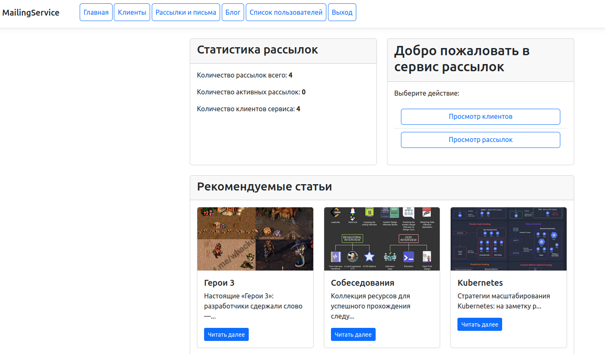
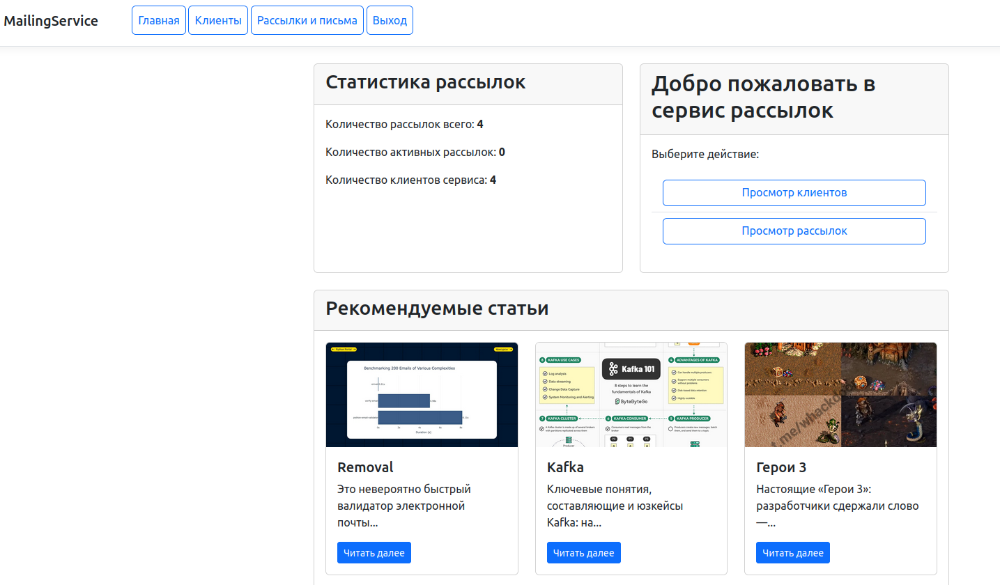

# Приложения для рассылки писем зарегестрированными пользователями и ведения блога.
* Реализована отправка рассылок с помощью crontab
* Реализованы права доступа модератора для ведения блога, блокировки пользователей, и отключения рассылок.
* Статистика рассылок и пользователей выведена на домашнюю страницу.
* Вывод записей блога на домашнюю страницу

### Отображение у модератора

### Отображение у пользователя

