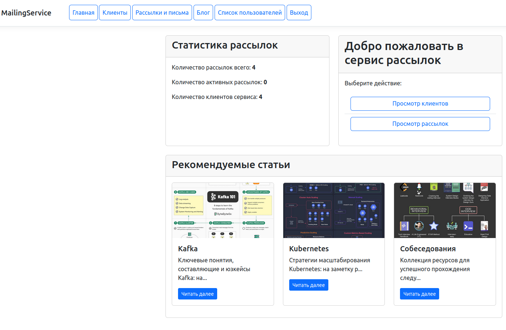
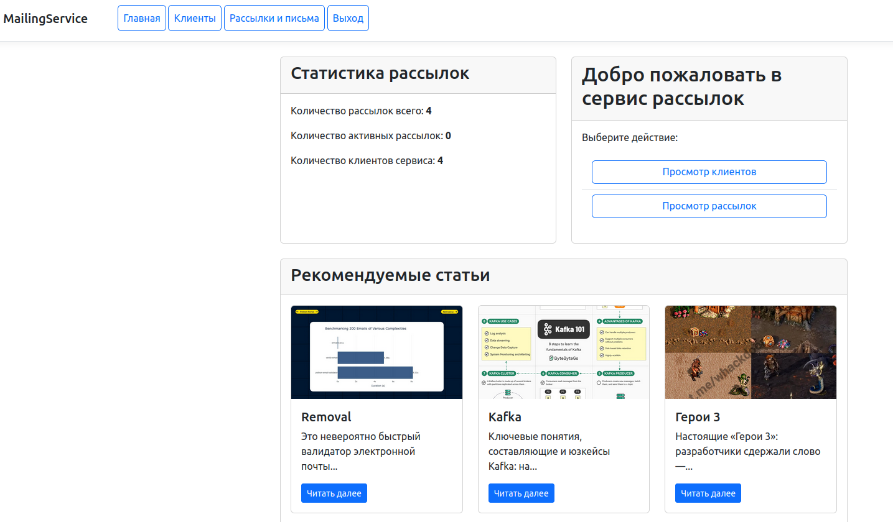
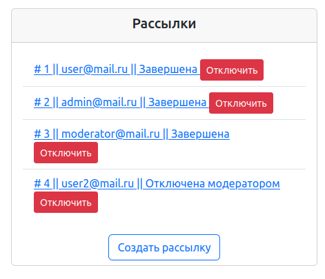
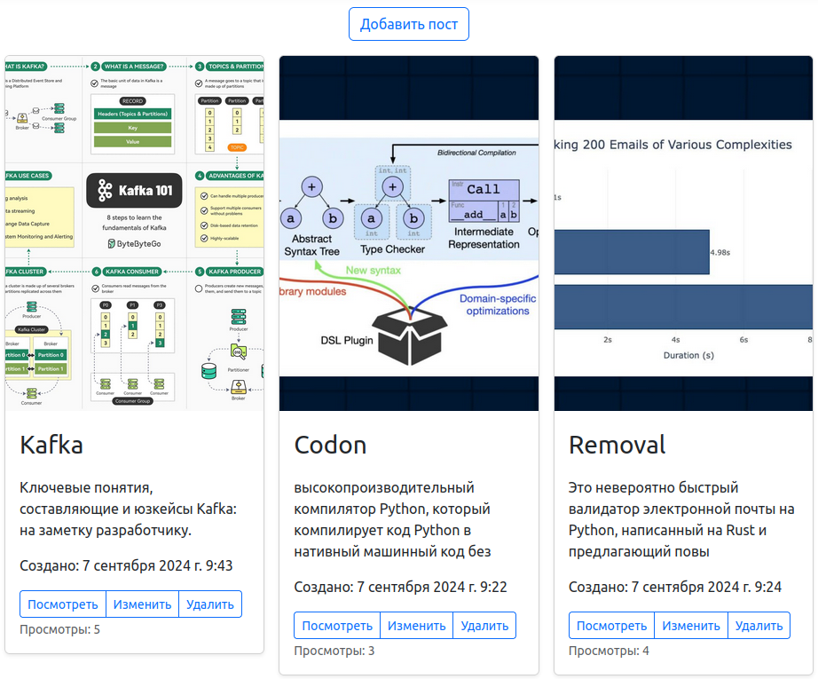
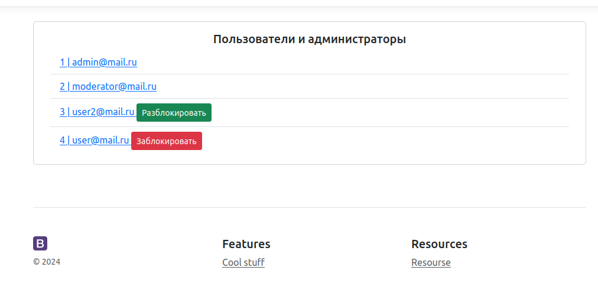

## Приложения для рассылки писем зарегестрированными пользователями и ведения блога модератором.
* Реализована отправка рассылок с помощью crontab
* Реализованы права доступа модератора для ведения блога, блокировки пользователей, и отключения рассылок.
* Статистика рассылок и пользователей выведена на домашнюю страницу.
* Вывод записей постов модератора на домашнюю страницу
* Выполнено кеширование раздела блога с помощью Redis

### Отображение меню у модератора

### Отображение меню у пользователя

### Модератор видит все рассылки и может отключать у любого пользователя

### Модератор может добавлять, изменять, удалять посты

### Модератор видит список пользователей может блокировать и разблокировать их, но не админов

